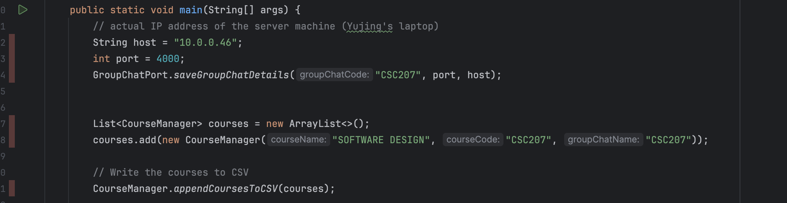

# StudyBuddies
This software would allow students to create an account with a profile that displays all their enrolled courses and their emails. Once users have logged in, they will join a group for each of their courses. Users can search for other students in their courses, using other users' profiles to see which courses they are enrolled in and their emails. Each course will have a group chat that will include all the students enrolled in that course.

## Whole Project Walk Through (Logics behind)
1. When you launch the app you can sign in and log in.
2. After logging in, on the main page you can choose to go to search courses or go to groupchats you joined.
3. If you go to search courses, you can search courses, if a course exists you are asked to join the related course groupchat or not join,if you join the grouchat you can either go to the groupchat that you join or search other courses. If the course is not existed you can choose to create one.
4. On the main page if you choose the go the groupchat open you will see a list of groupchats that you joined, you click into one of them and talk to other group members, you can see other group members' profiles by clicking them.
5. Users can then leave groupchat after joining.

## Program Workflow Overview
To ensure the program executes properly, please first confirm the IP address of the server machine. This IP address will be used as the host and must be configured on every client side. The configuration procedures are described below:

In the terminal or command prompt, use the command ipconfig /all to find the IPv4 address of the server machine (e.g., laptop). Copy this IPv4 address and paste it into the host variable in the main method of the GroupChatPort class located in the SocketIO folder. Run this main method to configure and initialize the setup for the Software Design course (CSC207). The group chat can then be accessed using the server's IP address as the host and port number 4000. After completing this setup, run the Main class located in the APP folder to display the API for StudyBuddies.

After logging in, if you click on “Go to Search Course”, you can search for a course either by its name or course code. The search function is not case-sensitive, allowing you to search for a course using uppercase, lowercase, or a mix of both. If the course exists, the system will prompt you to join it. If you choose to join, the course will be added to your course list, and you will be connected to the group chat for that course. If the course does not exist in the system, the API will ask if you want to create it. If you choose to create the course, you will be prompted to provide the course name and course code. The program will then use this information to create the course and set up a corresponding group chat. The group chat's host will be the IP address of the server machine, and the port number will be one higher than the current largest port number already in use. This ensures that each group chat is associated with a unique port number.

After logging in, if you click on "Go to Your Courses" and then click the orange "Group Chat" button, a list of courses you have already enrolled in will be displayed. You can then select the course you want and click "Join" to enter the group chat for that course.

After logging in, click on 'Go to Your Courses,' then select the green 'Profile' button to view your profile, which displays your name, email, and enrolled courses.

Similarly, after logging in, you can click 'Go to Your Courses' and then select the yellow 'Create Event' button to access the event creation UI. Enter the Event Name, Event Location, Max Attendance, Event Type, Event Start/End Date, and Event Start/End Time, then click 'Create' to finalize your event. You can view your created events by selecting 'Choose Your Event' from the drop-down list. Once you choose the desired event, click the 'My Event' button to see all the event details you previously created.
